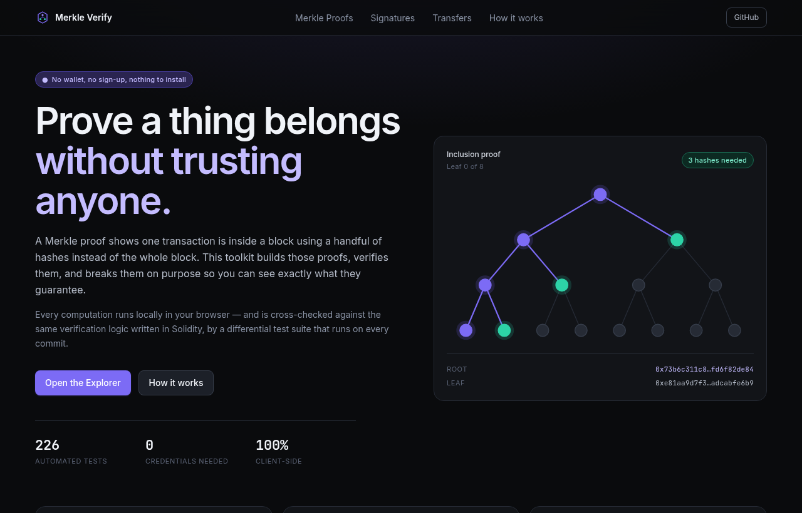
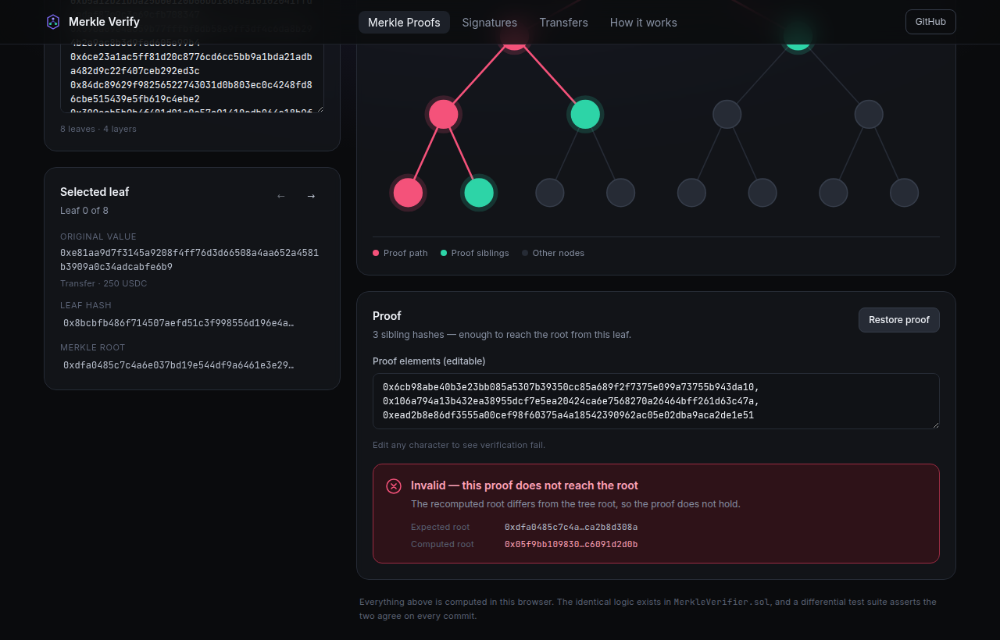
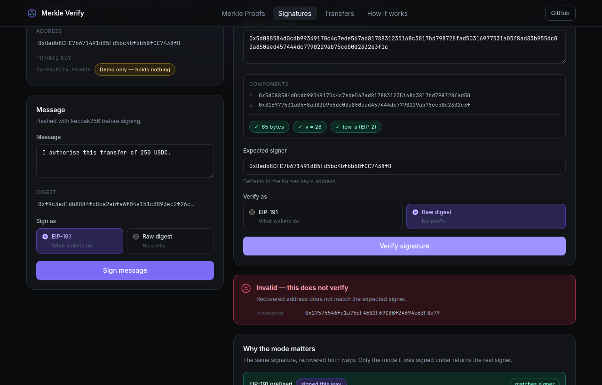
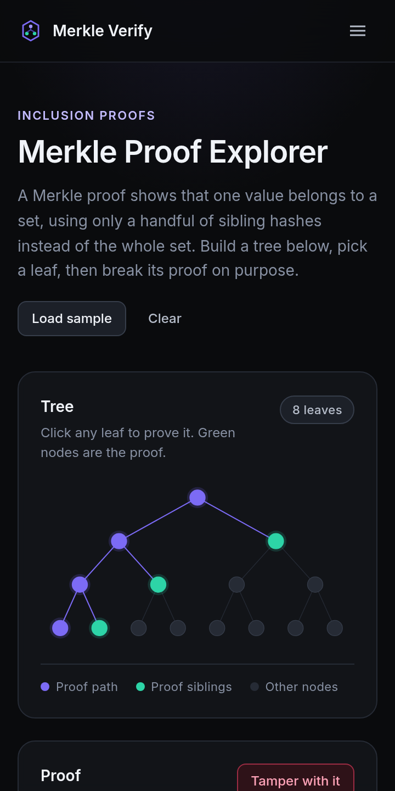

<div align="center">

# Merkle Verify

**Prove a thing belongs — without trusting anyone.**

A browser-native toolkit for Merkle inclusion proofs and ECDSA signer recovery, cross-checked against the same verification logic written in Solidity.

[](https://github.com/DeAtHfIrE26/Merkle_Verif_BlockChain/actions/workflows/ci.yml)
[](docs/TESTING.md)
[](LICENSE)

</div>

---

## What it does

A Merkle proof shows that one transaction is inside a block using a handful of hashes instead of the whole block. This toolkit builds those proofs, verifies them, and **breaks them on purpose** so you can see exactly what they guarantee.

Three tools, no credentials of any kind:

| Tool | What you can do |
|---|---|
| **Merkle Proof Explorer** | Build a tree from any values, click any leaf to get its inclusion proof, then tamper with the proof and watch verification fail — with the computed root shown next to the expected one. |
| **Signature Verifier** | Sign a message with a throwaway key generated in your browser, then recover the signer. Shows **EIP-191 and raw** recovery side by side. |
| **Transfer Tracker** | A token transfer feed rendered from simulated data, next to the subgraph query a live deployment would run. Labelled as simulated on every surface. |

> **No wallet. No sign-up. No API keys. Nothing to install.** Every computation runs locally in your browser. There is no demo account because there is no account.

## Live demo

**Not yet deployed** — one repository setting away.

Set **Settings → Pages → Build and deployment → Source: "GitHub Actions"**, then re-run the *Deploy to GitHub Pages* workflow, and the site publishes to
`https://deathfire26.github.io/Merkle_Verif_BlockChain/`. A workflow cannot switch Pages on by itself: creating a Pages site needs admin scope that the automatic `GITHUB_TOKEN` does not carry.

The Vercel route is also ready (import the repo, root directory `apps/web`, no environment variables) — see [`docs/DEPLOYMENT.md`](docs/DEPLOYMENT.md). Everything is built and CI-verified; only the hosting switch remains.

Run it locally in under a minute — see [Getting started](#getting-started).

## Why this is interesting

**The same Merkle logic exists twice: TypeScript that runs in your browser, and Solidity that would run on-chain.** If those two ever disagreed, the app would show a proof as valid that the chain rejects.

So they are pinned together by a differential test suite. It builds randomised trees across **17 shapes** — powers of two, odd counts that force node promotion, primes — and asserts both implementations agree on every leaf, every tampered proof, every foreign leaf, and truncated and extended proofs alike. A deterministic PRNG seeds every case, so a failure is reproducible from the seed alone.

Two things the app deliberately surfaces rather than hides:

- **The EIP-191 trap.** Wallets never sign raw bytes; they prepend `"\x19Ethereum Signed Message:\n32"`. Verify against the wrong one and nothing errors — recovery still returns an address, just a stranger's. The Signature Verifier shows both results at once.
- **Second preimages in sorted-pair trees.** Leaves and internal nodes are both 32 bytes, so an internal node can be replayed as a leaf and will verify. The Explorer warns you when it spots one, and a contract test demonstrates it.

## Screenshots

| | |
|---|---|
|  |  |
| The landing page, with a live proof path cycling through the tree. | The Explorer after tampering — the proof no longer reaches the root. |
|  |  |
| Both recovery modes side by side; only the matching one returns the signer. | 360px. Every layout is checked for overflow at 360, 768 and 1280. |

## Architecture

```
apps/web/            Next.js 16 · React 19 · TypeScript · Tailwind — the UI
packages/core/       Framework-free crypto: Merkle build/prove/verify, ECDSA recovery
packages/contracts/  Solidity verifiers + the differential test suite
docs/                AUDIT · PLAN · TESTING · DEPLOYMENT
```

`packages/core` is the keystone: it is imported by **both** the web app and the contract tests, which is what makes the TypeScript-versus-Solidity parity testing possible.

Every route is prerendered as static content. There are no serverless functions, no database, no cron jobs and no runtime environment variables — so there is no free tier that can lapse, no cold start, and nothing that sleeps after a month of no visitors.

## Tech stack, and why

| Choice | Reason |
|---|---|
| **Next.js 16 + TypeScript** | Static export and Vercel-native deploy from one codebase; types matter for hex-shaped data. |
| **Tailwind** | Design tokens in CSS, no config drift, small output. |
| **viem** | Modern, tree-shakeable, excellent types — roughly a tenth of ethers for the few primitives needed. |
| **Hardhat + ethers v6** | Replaces the abandoned Waffle stack the project inherited, which could not even `npm install`. |
| **Vitest + Playwright** | Fast unit runs; real browser coverage on desktop and mobile viewports. |
| **solc from npm** | Same compiler as the official binaries, resolved from the lockfile, so builds work offline and in sandboxed CI. |

## Getting started

Requires **Node 22** (`.nvmrc` is provided).

```bash
git clone https://github.com/DeAtHfIrE26/Merkle_Verif_BlockChain.git
cd Merkle_Verif_BlockChain
npm ci
npm run dev          # http://localhost:3000
```

That is the whole setup. **No `.env` file is needed** — not for the app, not for the tests, not even to compile the contracts.

### Scripts

| Command | What it does |
|---|---|
| `npm run dev` | Start the app in development. |
| `npm run build` | Production build (builds the shared package first). |
| `npm run verify` | lint + typecheck + unit + contract tests + build. |
| `npm run test:unit` | 85 tests — `packages/core`. |
| `npm run test:contracts` | 41 tests — contracts, including TS↔Solidity parity. |
| `npm run test:e2e` | 100 tests — Playwright on Chrome and Pixel 7. |
| `npm run lint` · `npm run typecheck` | Static checks. |

### Environment variables

The app requires **none**. [`.env.example`](.env.example) documents the optional ones, which only enable on-chain verification and contract deployment. Names and descriptions only — never values.

## Testing

**226 tests, all passing:** 85 unit, 41 contract, 100 end-to-end. Every E2E test also fails on any console error, failed request or HTTP ≥ 400.

Full breakdown, including **what is deliberately not tested and why**, in [`docs/TESTING.md`](docs/TESTING.md).

## Project history

This repository began as three disconnected assignment submissions. [`docs/AUDIT.md`](docs/AUDIT.md) is the read-only audit that preceded the rebuild, written before anything was changed. Among other things it found that:

- `npm install` failed outright in one sub-project, and four required dependencies were missing from another's `package.json` *and* its lockfile.
- The signature verifier's only happy-path test **failed**, while three others passed vacuously — they asserted `false` against a contract that returned `false` for essentially everything.
- The subgraph pointed at `0xMockUSDCContractAddress...`, which is not a valid address, so it had never been deployable.
- An Infura project ID was committed to a public repository across 8 commits.

The audit is kept in the repository rather than quietly deleted, because the rebuild only makes sense next to it.

## Security notes

- **No secrets in this repository**, and none required to run it.
- The committed Infura key was removed from the working tree. It remains in git history by deliberate choice — rewriting a public repository's history breaks every existing clone and fork, and rotating the key makes the old value worthless. **If you have not rotated it, do that.**
- `npm audit --omit=dev` reports **zero vulnerabilities**. Remaining dev-only advisories live in Hardhat 2's transitive tree; see [`docs/TESTING.md`](docs/TESTING.md).

## Roadmap

Honest about what is not here:

- **Schnorr and RSA verification.** The contract's enum reserves them; both revert with `SchemeNotImplemented`. They are *not* implemented, and the contract does not pretend otherwise by returning `false`.
- **On-chain verification against a deployed contract.** The code path exists behind an environment variable but has never been exercised — every Ethereum RPC was blocked from the environment this was built in.
- **Live subgraph indexing and push notifications.** Cut deliberately; the Transfer Tracker explains why on the page.

## License

[MIT](LICENSE) © Kashyap Patel

<div align="center">
<sub><a href="https://github.com/DeAtHfIrE26">GitHub</a> · <a href="https://www.linkedin.com/in/kashyap-patel2673/">LinkedIn</a></sub>
</div>
